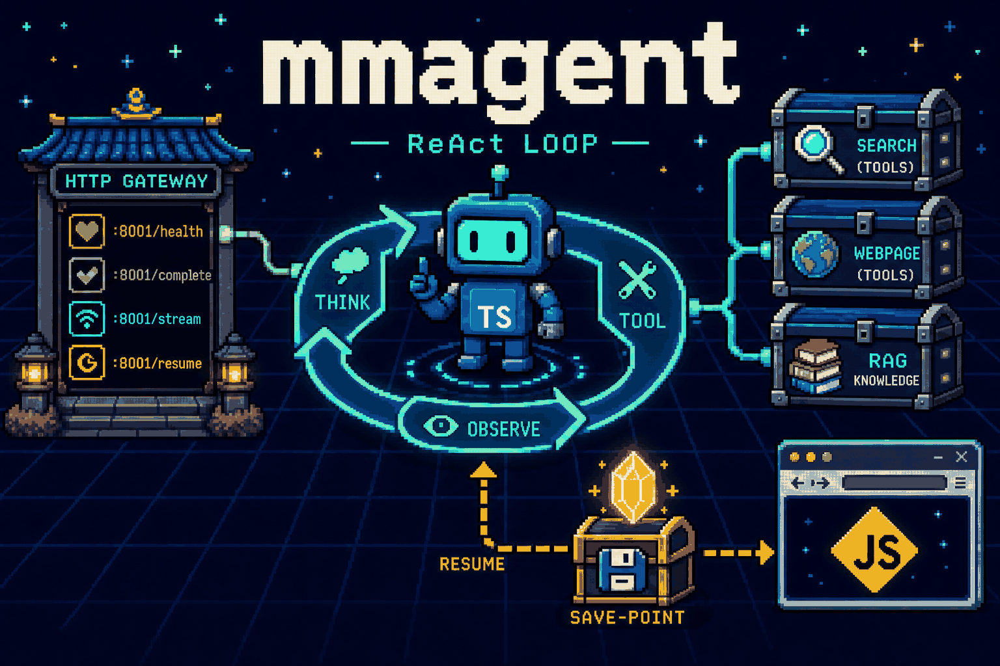
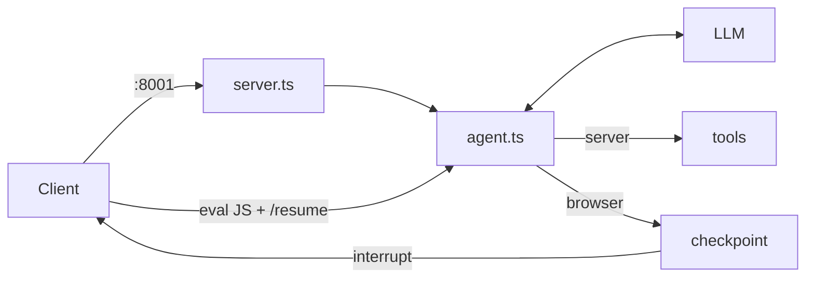

<h1 align="center">mmagent</h1>

<p align="center">
  
</p>

<p align="center">
  
  
</p>

TypeScript 写的最小 ReAct Agent：OpenAI function calling 调工具，HTTP 对外，浏览器工具用 checkpoint 中断再续跑。

## 架构




| 层    | 文件                  | 做什么                                                                                      |
| ---- | ------------------- | ---------------------------------------------------------------------------------------- |
| HTTP | `src/server.ts`     | `GET /health`；`POST /complete`、`/complete/stream`、`/resume`、`/resume/stream`             |
| 循环   | `src/agent.ts`      | 协议提示词 + 人设 + 对话；reason → tool → observe，直到终答或挂起                                          |
| 挂起   | `src/checkpoint.ts` | `run_browser_code` 不在 Node 执行：落盘 `runs/<uuid>.json`，等客户端 eval 后 `/resume`                |
| 工具   | `src/tools/`        | `Tool` 接口 + `createTools()` 唯一注册口。默认 search / visit / browser；设了 `RAG_SEARCH_URL` 才挂 RAG |
| CLI  | `run_agent.ts`      | 本地跑一轮，不走 HTTP                                                                            |


服务端工具当场 `execute`。`execution: "browser"` 的工具进入 pending，HTTP 返回 `interrupt`（`run_id` + pending），客户端跑完 JS 再 POST `/resume`。

## 开发

```bash
npm install
cp .env.example .env   # OPENAI_API_KEY、MODEL；兼容端点再设 OPENAI_BASE_URL
npm start              # CLI
npm run server         # HTTP :8001（可用 PORT 改）
npm test
npm run typecheck
```

加工具：复制 `src/tools/tool-template.ts` → `src/tools/<kebab-name>.ts`，填 `name` / `description` / `parameters` / `execute`，在 `createTools()` 里 `new` 一行。不要改 `agent.ts` / `server.ts`。浏览器侧工具设 `execution: "browser"`，`execute` 不会被服务端调用。

## 镜像

`main` 推送后构建并推 GHCR。当前最新：**v9**（与 `latest` 相同）。

```bash
docker pull ghcr.io/2p1c/mmagent:latest
# 或锁定版本：docker pull ghcr.io/2p1c/mmagent:v9
```


